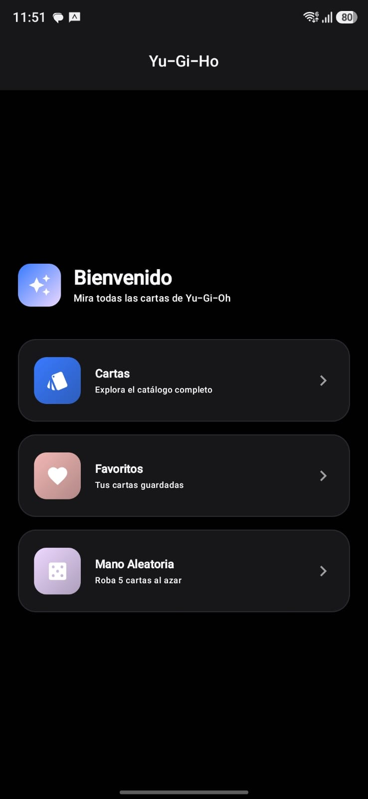
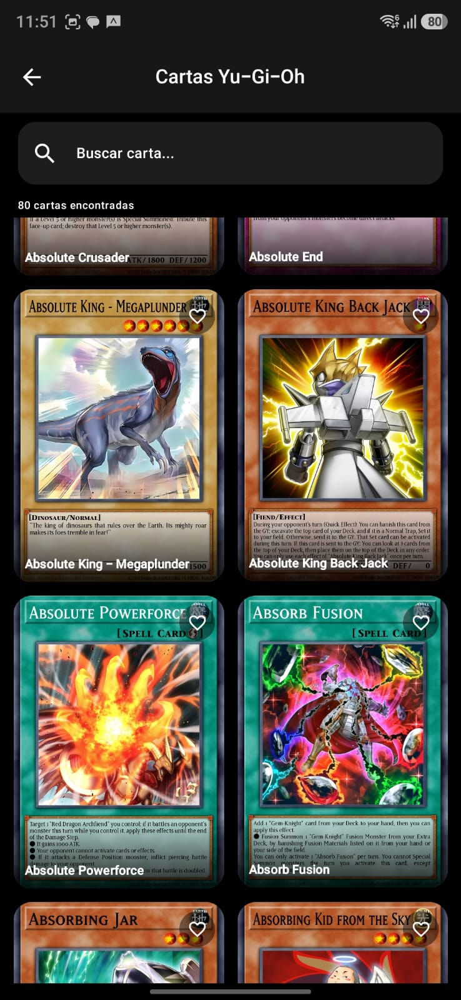
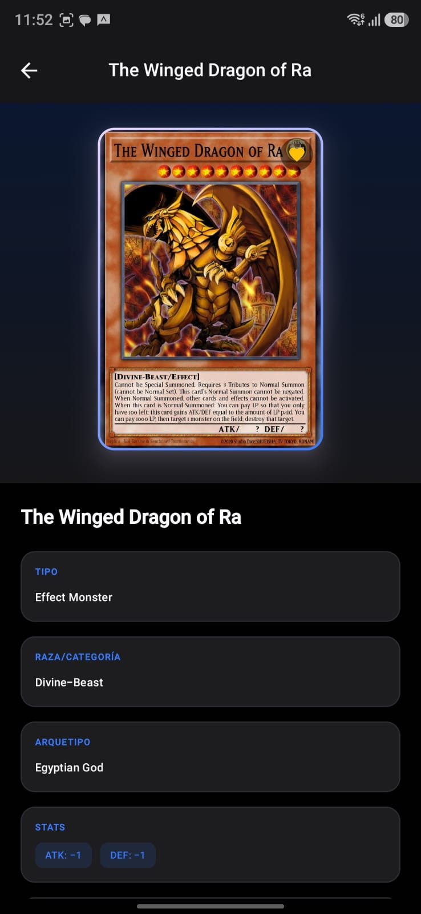
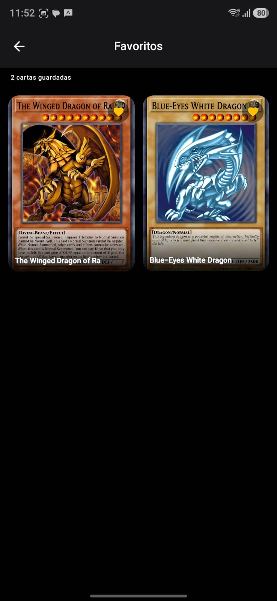

# RETO DEV ANDROID (MAZO DE CARTAS YU-GI-HO)

Descripción:
Desarrollar una aplicación móvil Android utilizando Kotlin y Jetpack Compose, aplicando
buenas prácticas modernas de desarrollo, arquitectura limpia y principios SOLID.

Arquitectura:
Clean Arquitecture que permite una buena escalabilidad en el proyecto y sobre todo por su buena
distribución del proyecto, también MVVM, que permite el manejo y control de estados en las pantallas 

Tecnologías utilizadas: Retrofit, Dagger Hilt, Corutinas, Flow, Room

Librerias: Navigation, Coil, Retrofit, Dagger Hilt, Room e Iconos extendidos 

Cómo ejecutar el proyecto: Se buscaron versiones estables para evitar configuraciones extra,
por lo que solo con descargar las librerias del gradle deberia de poder correr la app sin problema

## Capturas de pantalla:
 ### Home Screen

### Lista de Cartas

### Detalle de Carta

### Favoritos

